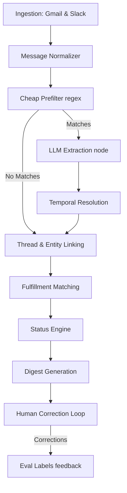

# Circle Back

**A personal agent that tracks commitments made across email and Slack — yours and others' — and surfaces what's at risk before it becomes a broken promise.**

---

## 1. Problem Statement

People make and receive dozens of small commitments a week buried inside email threads and Slack messages — *"I'll send this by Friday,"* *"let me get back to you on that,"* *"I'll loop in legal and follow up."* None of this lives in a task manager. It gets lost in scroll, leading to two costly failure modes:
1. You forget something you promised, and someone else notices before you do.
2. You're waiting on something someone else promised, and you don't realize it's overdue until it blocks you.

**Circle Back** is a state machine that extracts commitments from real conversations, resolves vague temporal language into real deadlines, watches for evidence of fulfillment, and tells you — with appropriate uncertainty — what's actually at risk.

**Core design commitment:** The system must never claim false certainty. Absence of evidence that something was done is surfaced as *"no evidence found, please confirm"* — never as a verdict that something was missed.

---

## 2. Pipeline Architecture

The backend utilizes **LangGraph** to implement a deterministic, inspectable state machine with separate, unit-testable nodes.



### Pipeline Node Explanations:
1. **Ingestion & Normalizer**: Syncs messages incrementally and maps the channels into a unified schema, maintaining soft-deletes to prevent silent data loss.
2. **Cheap Prefilter**: Uses regex patterns to filter out irrelevant messages at scale and minimize LLM expenses.
3. **LLM Extraction**: Uses Claude via structured output to identify individual commitments, bias-calibrating towards precision over recall.
4. **Temporal Resolution**: Parses relative phrasing ("by next Friday", "tomorrow morning") into concrete datetime deadlines.
5. **Thread/Entity Linking**: Matches threads across platforms and maps user accounts using manual seed lists.
6. **Fulfillment Matching**: Checks subsequent thread context semantically to verify if the committer fulfilled or renegotiated the deadline.
7. **Status Engine**: Transitions open commitments to `at_risk` or `overdue` with traceable evidence trails.

---

## 3. Data Model

The PostgreSQL schema is structured around the conversation evidence trail:

- **Person**: Unified cross-channel entity representing a participant with their respective emails and Slack IDs.
- **Message**: Normalized email/Slack message log.
- **Thread**: Conversation grouping.
- **Commitment**: The core model tracking promise direction, type (simple, delegated, conditional, recurring), resolved deadline, confidence score, and status.
- **CommitmentEvent**: Append-only log tracking lifecycle transitions (extracted, renegotiated, fulfilled, deleted, dismissed).
- **EvalLabel**: Ground-truth storage mapping messages to expected labels for the evaluation harness.

---

## 4. Key Design Decisions

### Bias Precision Over Recall
To maintain user trust, we prioritize precision over recall. Flagging false commitments leads to notification fatigue and trust degradation. If Claude has low confidence in a candidate, it routes it to the **Review Queue** for manual triage, keeping the main **Commitment Digest** clear of noise.

### Absence of Evidence != Evidence of Absence
When a deadline passes without a matching semantic message confirming completion, Circle Back surfaces this status as **"no evidence of completion found"** rather than declaring failure.

### Manual Identity Resolution
Automatic cross-channel person resolution runs high false-positive risk. In v1, the identity mapping is seeded manually by the user, providing complete control over cross-channel grouping.

---

## 5. Setup & Local Development

### Backend (Python / FastAPI)
1. Navigate to the backend directory:
   ```bash
   cd backend
   ```
2. Copy the `.env.example` file and configure your credentials:
   ```bash
   cp .env.example .env
   ```
3. Run migrations and start the server:
   ```bash
   uv venv
   uv pip install -e ".[dev]"
   uv run python -m pytest  # Verify all tests pass
   uv run uvicorn circleback.main:app --reload
   ```

### Frontend (Next.js / TypeScript / Tailwind CSS)
1. Navigate to the frontend directory:
   ```bash
   cd frontend
   ```
2. Install dependencies and start the development server:
   ```bash
   npm install
   npm run dev
   ```
3. Access the dashboard at `http://localhost:3000`.

---

## 6. Evaluation Harness

Circle Back comes with a built-in evaluation harness located at `/metrics` page and via backend `run_evaluation()` tests. It runs the entire extraction pipeline against a curated set of **120+ labeled fixtures** containing sarcastic, delegated, conditional, and edge-case text samples to verify F1, Precision, and Recall scores honestly before deployment.